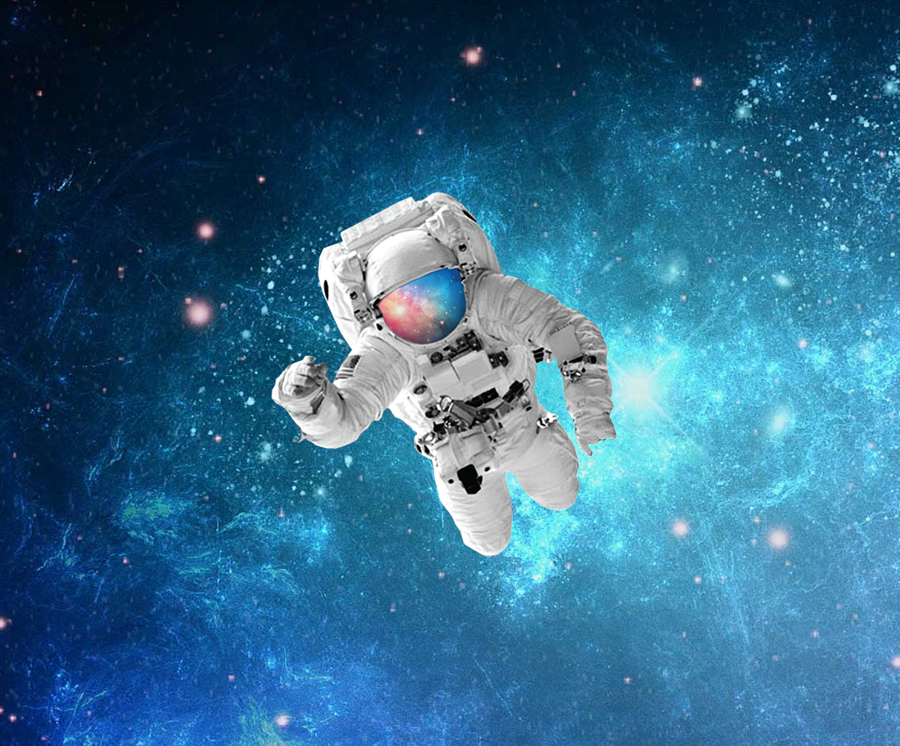

# 🌌 Projeto Astronauta

Este projeto foi desenvolvido como um desafio prático do curso de **HTML5 e CSS3** Módulo 2 do [Curso em Vídeo]([https://www.cursoemvideo.com](https://www.youtube.com/watch?v=vPNIAJ9B4hg&list=PLHz_AreHm4dlUpEXkY1AyVLQGcpSgVF8s)).
Focado em dominar uma das tarefas mais comuns e fundamentais do desenvolvimento front-end: a centralização absoluta de elementos (horizontal e vertical) utilizando **CSS Flexbox**.

---

---

## 🚀 Tecnologias Utilizadas

O projeto foi construído de forma simples e eficiente utilizando:
- **HTML5** para a estrutura.
- **CSS3** para estilização e posicionamento.
- **Flexbox Layout** para o alinhamento responsivo.

## 🧠 Desafios e Aprendizados

Neste projeto, apliquei conceitos essenciais de design responsivo e layout:
- **Viewport Units (`vh`)**: Utilizei `min-height: 100vh` para garantir que o container ocupasse toda a altura da tela, permitindo o alinhamento vertical.
- **Box Sizing**: Aplicação de `box-sizing: border-box` para um controle mais preciso das dimensões dos elementos.
- **Background Styling**: Uso de `background-size: cover` para garantir que a imagem de fundo preencha a tela sem distorções.

## 📸 Demonstração

Você pode visualizar o projeto online aqui: **[Projeto Astronauta](https://anaClarissi.github.io/desafio-astronauta/)**

---

## ✒️ Autor
Desenvolvido por **Ana Clarissi** – [Acesse meu LinkedIn](https://www.linkedin.com/in/anaclarissi/)

